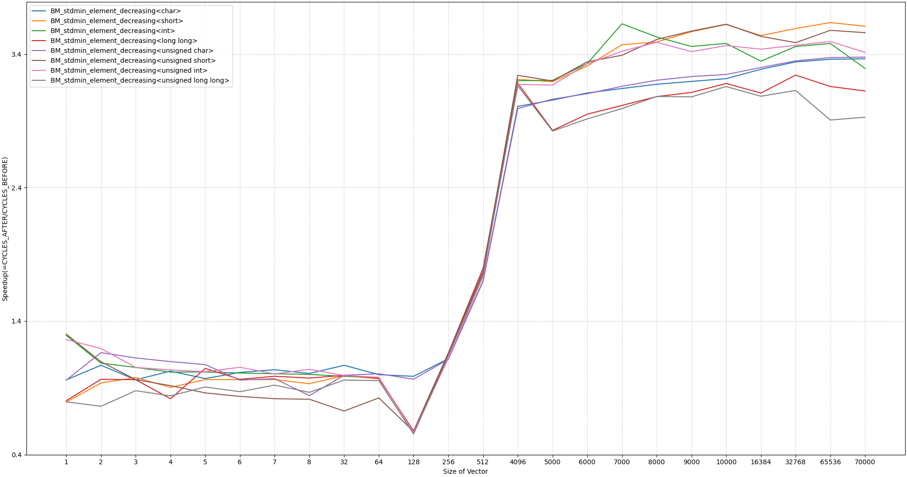
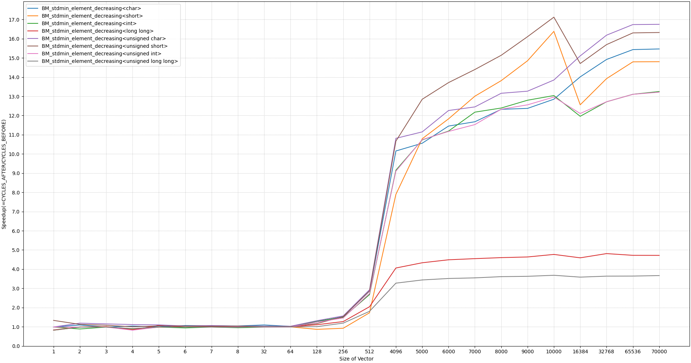

## Optimizing std::min_element/argmin in libcxx

### Figures:
When vectorization is **not** enabled:
- Upto 3x speedup (in cycles) 
- Outlier: *long long* and *unsigned long long* had a 50% regression.


When vectorization is enabled:
- Upto 22x speedup (in cycles)


### Numbers:
The benchmark result files generated from google_benchmark are in the repo:
- `min_element_before.json`
- `min_element_after.json`: performance after using the new algorithm. 
- `min_element_after_novec.json`: performance after using the new algorithm with vectorization

#### Comparing `min_element_before.json` to `min_element_after_novec.json`
```
Benchmark                                                             Time             CPU      Time Old      Time New       CPU Old       CPU New
-----------------------------------------------------------------------------------------------------------------------------------------------------
BM_stdmin_element_decreasing<char>/1                                  -0.0001         -0.0001             1             1             1             1
BM_stdmin_element_decreasing<char>/2                                  -0.0910         -0.0910             2             1             2             1
BM_stdmin_element_decreasing<char>/3                                  -0.0001         -0.0001             2             2             2             2
BM_stdmin_element_decreasing<char>/4                                  -0.0487         -0.0487             3             2             3             2
BM_stdmin_element_decreasing<char>/5                                  -0.0177         -0.0177             3             3             3             3
BM_stdmin_element_decreasing<char>/6                                  -0.1032         -0.1032             4             3             4             3
BM_stdmin_element_decreasing<char>/7                                  -0.0637         -0.0637             4             4             4             4
BM_stdmin_element_decreasing<char>/8                                  -0.0389         -0.0389             5             5             5             5
BM_stdmin_element_decreasing<char>/32                                 -0.0933         -0.0933            16            15            16            15
BM_stdmin_element_decreasing<char>/64                                 -0.0342         -0.0342            35            34            35            34
BM_stdmin_element_decreasing<char>/128                                -0.6367         -0.6367            73            26            73            26
BM_stdmin_element_decreasing<char>/256                                -0.6864         -0.6864           149            47           149            47
BM_stdmin_element_decreasing<char>/512                                -0.7078         -0.7078           301            88           301            88
BM_stdmin_element_decreasing<char>/4096                               -0.7161         -0.7161          2432           691          2432           691
BM_stdmin_element_decreasing<char>/5000                               -0.7165         -0.7165          2970           842          2970           842
BM_stdmin_element_decreasing<char>/6000                               -0.7215         -0.7215          3564           992          3564           992
BM_stdmin_element_decreasing<char>/7000                               -0.7222         -0.7223          4158          1155          4158          1155
BM_stdmin_element_decreasing<char>/8000                               -0.7213         -0.7213          4752          1325          4752          1324
BM_stdmin_element_decreasing<char>/9000                               -0.7233         -0.7233          5346          1479          5346          1479
BM_stdmin_element_decreasing<char>/10000                              -0.7242         -0.7242          5940          1639          5940          1638
BM_stdmin_element_decreasing<char>/16384                              -0.7236         -0.7236          9733          2690          9733          2690
BM_stdmin_element_decreasing<char>/32768                              -0.7259         -0.7259         19471          5338         19471          5337
BM_stdmin_element_decreasing<char>/65536                              -0.7260         -0.7260         38944         10670         38942         10670
BM_stdmin_element_decreasing<char>/70000                              -0.7252         -0.7252         41592         11428         41591         11427
BM_stdmin_element_decreasing<short>/1                                 +0.2002         +0.2002             1             1             1             1
BM_stdmin_element_decreasing<short>/2                                 +0.0002         +0.0002             1             1             1             1
BM_stdmin_element_decreasing<short>/3                                 -0.0234         -0.0234             2             2             2             2
BM_stdmin_element_decreasing<short>/4                                 +0.1739         +0.1739             2             2             2             2
BM_stdmin_element_decreasing<short>/5                                 +0.0002         +0.0002             3             3             3             3
BM_stdmin_element_decreasing<short>/6                                 +0.0004         +0.0004             3             3             3             3
BM_stdmin_element_decreasing<short>/7                                 +0.0001         +0.0001             3             3             3             3
BM_stdmin_element_decreasing<short>/8                                 +0.0002         +0.0002             4             4             4             4
BM_stdmin_element_decreasing<short>/32                                -0.0272         -0.0272            15            15            15            15
BM_stdmin_element_decreasing<short>/64                                -0.0060         -0.0060            33            33            33            33
BM_stdmin_element_decreasing<short>/128                               +0.6706         +0.6706            75           126            75           126
BM_stdmin_element_decreasing<short>/256                               -0.1521         -0.1521           151           128           151           128
BM_stdmin_element_decreasing<short>/512                               -0.4292         -0.4292           304           173           304           173
BM_stdmin_element_decreasing<short>/4096                              -0.6926         -0.6926          2433           748          2433           748
BM_stdmin_element_decreasing<short>/5000                              -0.6912         -0.6912          2970           917          2970           917
BM_stdmin_element_decreasing<short>/6000                              -0.7027         -0.7027          3564          1060          3564          1060
BM_stdmin_element_decreasing<short>/7000                              -0.7110         -0.7110          4158          1202          4158          1202
BM_stdmin_element_decreasing<short>/8000                              -0.7188         -0.7188          4754          1337          4754          1337
BM_stdmin_element_decreasing<short>/9000                              -0.7231         -0.7231          5347          1481          5346          1481
BM_stdmin_element_decreasing<short>/10000                             -0.7269         -0.7269          5941          1622          5941          1622
BM_stdmin_element_decreasing<short>/16384                             -0.7205         -0.7205          9738          2721          9738          2721
BM_stdmin_element_decreasing<short>/32768                             -0.7249         -0.7249         19472          5357         19472          5356
BM_stdmin_element_decreasing<short>/65536                             -0.7277         -0.7277         38941         10602         38940         10602
BM_stdmin_element_decreasing<short>/70000                             -0.7263         -0.7263         41594         11386         41592         11385
BM_stdmin_element_decreasing<int>/1                                   +0.0003         +0.0002             1             1             1             1
BM_stdmin_element_decreasing<int>/2                                   +0.1115         +0.1115             1             1             1             1
BM_stdmin_element_decreasing<int>/3                                   +0.0004         +0.0004             2             2             2             2
BM_stdmin_element_decreasing<int>/4                                   +0.0665         +0.0665             2             2             2             2
BM_stdmin_element_decreasing<int>/5                                   +0.0004         +0.0004             3             3             3             3
BM_stdmin_element_decreasing<int>/6                                   +0.0479         +0.0479             3             3             3             3
BM_stdmin_element_decreasing<int>/7                                   +0.0004         +0.0004             4             4             4             4
BM_stdmin_element_decreasing<int>/8                                   +0.0375         +0.0374             4             4             4             4
BM_stdmin_element_decreasing<int>/32                                  +0.0010         +0.0010            15            15            15            15
BM_stdmin_element_decreasing<int>/64                                  -0.0261         -0.0262            34            33            34            33
BM_stdmin_element_decreasing<int>/128                                 +0.1006         +0.1005            75            83            75            83
BM_stdmin_element_decreasing<int>/256                                 -0.6620         -0.6620           151            51           151            51
BM_stdmin_element_decreasing<int>/512                                 -0.6954         -0.6954           304            92           304            92
BM_stdmin_element_decreasing<int>/4096                                -0.7227         -0.7227          2433           675          2433           675
BM_stdmin_element_decreasing<int>/5000                                -0.7059         -0.7059          2970           874          2970           874
BM_stdmin_element_decreasing<int>/6000                                -0.7137         -0.7137          3565          1021          3565          1021
BM_stdmin_element_decreasing<int>/7000                                -0.7186         -0.7186          4158          1170          4158          1170
BM_stdmin_element_decreasing<int>/8000                                -0.7210         -0.7211          4754          1326          4754          1326
BM_stdmin_element_decreasing<int>/9000                                -0.7122         -0.7122          5351          1540          5350          1540
BM_stdmin_element_decreasing<int>/10000                               -0.7140         -0.7140          5945          1700          5945          1700
BM_stdmin_element_decreasing<int>/16384                               -0.7156         -0.7156          9737          2769          9737          2769
BM_stdmin_element_decreasing<int>/32768                               -0.7171         -0.7171         19471          5509         19471          5509
BM_stdmin_element_decreasing<int>/65536                               -0.7144         -0.7144         38950         11123         38950         11123
BM_stdmin_element_decreasing<int>/70000                               -0.7135         -0.7135         41603         11917         41602         11917
BM_stdmin_element_decreasing<long long>/1                             +0.2005         +0.2005             1             1             1             1
BM_stdmin_element_decreasing<long long>/2                             +0.0004         +0.0004             1             1             1             1
BM_stdmin_element_decreasing<long long>/3                             +0.0912         +0.0912             2             2             2             2
BM_stdmin_element_decreasing<long long>/4                             +0.1432         +0.1433             2             2             2             2
BM_stdmin_element_decreasing<long long>/5                             +0.1769         +0.1769             3             3             3             3
BM_stdmin_element_decreasing<long long>/6                             +0.2004         +0.2004             3             4             3             4
BM_stdmin_element_decreasing<long long>/7                             +0.2179         +0.2178             3             4             3             4
BM_stdmin_element_decreasing<long long>/8                             +0.2518         +0.2518             4             5             4             5
BM_stdmin_element_decreasing<long long>/32                            +0.3143         +0.3143            15            20            15            20
BM_stdmin_element_decreasing<long long>/64                            +0.1734         +0.1734            33            39            33            39
BM_stdmin_element_decreasing<long long>/128                           +0.6420         +0.6419            75           124            75           124
BM_stdmin_element_decreasing<long long>/256                           -0.1476         -0.1475           152           130           152           130
BM_stdmin_element_decreasing<long long>/512                           -0.4303         -0.4303           305           174           305           174
BM_stdmin_element_decreasing<long long>/4096                          -0.6886         -0.6886          2440           760          2440           760
BM_stdmin_element_decreasing<long long>/5000                          -0.6591         -0.6591          2975          1014          2975          1014
BM_stdmin_element_decreasing<long long>/6000                          -0.6711         -0.6711          3577          1176          3577          1176
BM_stdmin_element_decreasing<long long>/7000                          -0.6789         -0.6789          4169          1339          4169          1339
BM_stdmin_element_decreasing<long long>/8000                          -0.6851         -0.6852          4768          1501          4767          1501
BM_stdmin_element_decreasing<long long>/9000                          -0.6914         -0.6914          5357          1653          5357          1653
BM_stdmin_element_decreasing<long long>/10000                         -0.6934         -0.6934          5945          1823          5945          1823
BM_stdmin_element_decreasing<long long>/16384                         -0.6877         -0.6877          9764          3049          9764          3049
BM_stdmin_element_decreasing<long long>/32768                         -0.6867         -0.6867         19531          6119         19531          6118
BM_stdmin_element_decreasing<long long>/65536                         -0.6901         -0.6901         39259         12168         39260         12167
BM_stdmin_element_decreasing<long long>/70000                         -0.6881         -0.6881         41796         13036         41794         13036
BM_stdmin_element_decreasing<unsigned char>/1                         +0.0004         +0.0004             1             1             1             1
BM_stdmin_element_decreasing<unsigned char>/2                         -0.0068         -0.0068             2             2             2             2
BM_stdmin_element_decreasing<unsigned char>/3                         -0.1301         -0.1302             2             2             2             2
BM_stdmin_element_decreasing<unsigned char>/4                         -0.0018         -0.0019             3             3             3             3
BM_stdmin_element_decreasing<unsigned char>/5                         -0.0618         -0.0618             3             3             3             3
BM_stdmin_element_decreasing<unsigned char>/6                         -0.0000         -0.0001             4             4             4             4
BM_stdmin_element_decreasing<unsigned char>/7                         +0.0366         +0.0366             4             4             4             4
BM_stdmin_element_decreasing<unsigned char>/8                         +0.0428         +0.0428             4             5             4             5
BM_stdmin_element_decreasing<unsigned char>/32                        -0.0165         -0.0165            15            15            15            15
BM_stdmin_element_decreasing<unsigned char>/64                        -0.0424         -0.0424            35            33            35            33
BM_stdmin_element_decreasing<unsigned char>/128                       -0.6369         -0.6369            73            26            73            26
BM_stdmin_element_decreasing<unsigned char>/256                       -0.6837         -0.6837           149            47           149            47
BM_stdmin_element_decreasing<unsigned char>/512                       -0.7068         -0.7068           301            88           301            88
BM_stdmin_element_decreasing<unsigned char>/4096                      -0.7210         -0.7210          2433           679          2433           679
BM_stdmin_element_decreasing<unsigned char>/5000                      -0.7203         -0.7203          2970           831          2970           831
BM_stdmin_element_decreasing<unsigned char>/6000                      -0.7214         -0.7215          3564           993          3564           993
BM_stdmin_element_decreasing<unsigned char>/7000                      -0.7224         -0.7224          4161          1155          4160          1155
BM_stdmin_element_decreasing<unsigned char>/8000                      -0.7231         -0.7231          4753          1316          4753          1316
BM_stdmin_element_decreasing<unsigned char>/9000                      -0.7237         -0.7237          5348          1477          5347          1477
BM_stdmin_element_decreasing<unsigned char>/10000                     -0.7236         -0.7236          5941          1642          5941          1642
BM_stdmin_element_decreasing<unsigned char>/16384                     -0.7250         -0.7250          9733          2677          9733          2677
BM_stdmin_element_decreasing<unsigned char>/32768                     -0.7258         -0.7258         19472          5339         19471          5339
BM_stdmin_element_decreasing<unsigned char>/65536                     -0.7257         -0.7257         38939         10680         38939         10680
BM_stdmin_element_decreasing<unsigned char>/70000                     -0.7258         -0.7258         41592         11404         41591         11403
BM_stdmin_element_decreasing<unsigned short>/1                        -0.2499         -0.2499             1             1             1             1
BM_stdmin_element_decreasing<unsigned short>/2                        -0.1110         -0.1110             1             1             1             1
BM_stdmin_element_decreasing<unsigned short>/3                        +0.0005         +0.0004             2             2             2             2
BM_stdmin_element_decreasing<unsigned short>/4                        -0.0655         -0.0658             2             2             2             2
BM_stdmin_element_decreasing<unsigned short>/5                        +0.0004         +0.0004             3             3             3             3
BM_stdmin_element_decreasing<unsigned short>/6                        -0.0473         -0.0473             3             3             3             3
BM_stdmin_element_decreasing<unsigned short>/7                        +0.0004         +0.0004             4             4             4             4
BM_stdmin_element_decreasing<unsigned short>/8                        -0.0367         -0.0367             4             4             4             4
BM_stdmin_element_decreasing<unsigned short>/32                       -0.0192         -0.0192            15            15            15            15
BM_stdmin_element_decreasing<unsigned short>/64                       -0.0175         -0.0175            34            33            34            33
BM_stdmin_element_decreasing<unsigned short>/128                      +0.7110         +0.7110            75           129            75           129
BM_stdmin_element_decreasing<unsigned short>/256                      -0.1509         -0.1509           152           129           152           129
BM_stdmin_element_decreasing<unsigned short>/512                      -0.4346         -0.4345           304           172           304           172
BM_stdmin_element_decreasing<unsigned short>/4096                     -0.6903         -0.6903          2433           754          2433           753
BM_stdmin_element_decreasing<unsigned short>/5000                     -0.6878         -0.6878          2970           927          2970           927
BM_stdmin_element_decreasing<unsigned short>/6000                     -0.7006         -0.7006          3564          1067          3564          1067
BM_stdmin_element_decreasing<unsigned short>/7000                     -0.7088         -0.7088          4158          1211          4158          1211
BM_stdmin_element_decreasing<unsigned short>/8000                     -0.7163         -0.7163          4753          1348          4753          1348
BM_stdmin_element_decreasing<unsigned short>/9000                     -0.7210         -0.7210          5346          1492          5346          1492
BM_stdmin_element_decreasing<unsigned short>/10000                    -0.7244         -0.7244          5941          1638          5941          1638
BM_stdmin_element_decreasing<unsigned short>/16384                    -0.7190         -0.7190          9738          2737          9738          2737
BM_stdmin_element_decreasing<unsigned short>/32768                    -0.7229         -0.7229         19473          5396         19473          5396
BM_stdmin_element_decreasing<unsigned short>/65536                    -0.7257         -0.7257         38943         10684         38942         10684
BM_stdmin_element_decreasing<unsigned short>/70000                    -0.7235         -0.7235         41595         11499         41594         11499
BM_stdmin_element_decreasing<unsigned int>/1                          -0.2500         -0.2500             1             1             1             1
BM_stdmin_element_decreasing<unsigned int>/2                          -0.1866         -0.1868             1             1             1             1
BM_stdmin_element_decreasing<unsigned int>/3                          -0.0830         -0.0830             2             2             2             2
BM_stdmin_element_decreasing<unsigned int>/4                          -0.0934         -0.0935             2             2             2             2
BM_stdmin_element_decreasing<unsigned int>/5                          -0.0553         -0.0552             3             3             3             3
BM_stdmin_element_decreasing<unsigned int>/6                          -0.0906         -0.0906             3             3             3             3
BM_stdmin_element_decreasing<unsigned int>/7                          -0.0416         -0.0415             4             3             4             3
BM_stdmin_element_decreasing<unsigned int>/8                          -0.0710         -0.0711             4             4             4             4
BM_stdmin_element_decreasing<unsigned int>/32                         -0.0323         -0.0322            15            15            15            15
BM_stdmin_element_decreasing<unsigned int>/64                         -0.0173         -0.0173            34            33            34            33
BM_stdmin_element_decreasing<unsigned int>/128                        +0.0987         +0.0987            75            83            75            83
BM_stdmin_element_decreasing<unsigned int>/256                        -0.6625         -0.6625           152            51           152            51
BM_stdmin_element_decreasing<unsigned int>/512                        -0.6963         -0.6963           304            92           304            92
BM_stdmin_element_decreasing<unsigned int>/4096                       -0.7227         -0.7227          2433           675          2433           675
BM_stdmin_element_decreasing<unsigned int>/5000                       -0.7059         -0.7059          2970           873          2970           873
BM_stdmin_element_decreasing<unsigned int>/6000                       -0.7133         -0.7133          3564          1022          3564          1022
BM_stdmin_element_decreasing<unsigned int>/7000                       -0.7188         -0.7188          4158          1169          4158          1169
BM_stdmin_element_decreasing<unsigned int>/8000                       -0.7224         -0.7224          4765          1323          4765          1323
BM_stdmin_element_decreasing<unsigned int>/9000                       -0.7139         -0.7139          5352          1531          5351          1531
BM_stdmin_element_decreasing<unsigned int>/10000                      -0.7157         -0.7157          5945          1690          5945          1690
BM_stdmin_element_decreasing<unsigned int>/16384                      -0.7170         -0.7170          9738          2756          9738          2756
BM_stdmin_element_decreasing<unsigned int>/32768                      -0.7185         -0.7185         19474          5482         19473          5482
BM_stdmin_element_decreasing<unsigned int>/65536                      -0.7157         -0.7157         38953         11073         38951         11073
BM_stdmin_element_decreasing<unsigned int>/70000                      -0.7149         -0.7149         41604         11862         41603         11862
BM_stdmin_element_decreasing<unsigned long long>/1                    +0.2005         +0.2004             1             1             1             1
BM_stdmin_element_decreasing<unsigned long long>/2                    +0.0005         +0.0004             1             1             1             1
BM_stdmin_element_decreasing<unsigned long long>/3                    +0.0913         +0.0913             2             2             2             2
BM_stdmin_element_decreasing<unsigned long long>/4                    +0.1433         +0.1433             2             2             2             2
BM_stdmin_element_decreasing<unsigned long long>/5                    +0.1769         +0.1769             3             3             3             3
BM_stdmin_element_decreasing<unsigned long long>/6                    +0.2005         +0.2005             3             4             3             4
BM_stdmin_element_decreasing<unsigned long long>/7                    +0.2179         +0.2179             3             4             3             4
BM_stdmin_element_decreasing<unsigned long long>/8                    +0.2395         +0.2395             4             5             4             5
BM_stdmin_element_decreasing<unsigned long long>/32                   +0.3142         +0.3142            15            20            15            20
BM_stdmin_element_decreasing<unsigned long long>/64                   +0.1708         +0.1708            33            39            33            39
BM_stdmin_element_decreasing<unsigned long long>/128                  +0.6606         +0.6606            75           125            75           125
BM_stdmin_element_decreasing<unsigned long long>/256                  -0.1496         -0.1496           151           129           151           129
BM_stdmin_element_decreasing<unsigned long long>/512                  -0.4390         -0.4390           303           170           303           170
BM_stdmin_element_decreasing<unsigned long long>/4096                 -0.6883         -0.6883          2438           760          2438           760
BM_stdmin_element_decreasing<unsigned long long>/5000                 -0.6589         -0.6590          2975          1015          2975          1015
BM_stdmin_element_decreasing<unsigned long long>/6000                 -0.6688         -0.6688          3570          1182          3570          1182
BM_stdmin_element_decreasing<unsigned long long>/7000                 -0.6785         -0.6786          4163          1338          4163          1338
BM_stdmin_element_decreasing<unsigned long long>/8000                 -0.6846         -0.6846          4758          1501          4758          1501
BM_stdmin_element_decreasing<unsigned long long>/9000                 -0.6911         -0.6911          5353          1654          5352          1654
BM_stdmin_element_decreasing<unsigned long long>/10000                -0.6945         -0.6946          5946          1816          5946          1816
BM_stdmin_element_decreasing<unsigned long long>/16384                -0.6884         -0.6884          9738          3034          9738          3034
BM_stdmin_element_decreasing<unsigned long long>/32768                -0.6856         -0.6856         19487          6127         19487          6127
BM_stdmin_element_decreasing<unsigned long long>/65536                -0.6821         -0.6821         39087         12427         39085         12426
BM_stdmin_element_decreasing<unsigned long long>/70000                -0.6845         -0.6845         41774         13180         41773         13180
OVERALL_GEOMEAN                                                       -0.4630         -0.4630             0             0             0             0                                                      -0.4630         -0.4630             0             0             0             0
```

#### Comparing min_element_before.json to min_element_after.json

```
Benchmark                                                                Time             CPU      Time Old      Time New       CPU Old       CPU New
-----------------------------------------------------------------------------------------------------------------------------------------------------
BM_stdmin_element_decreasing<char>/1                                  +0.0002         +0.0002             1             1             1             1
BM_stdmin_element_decreasing<char>/2                                  -0.0913         -0.0913             2             1             2             1
BM_stdmin_element_decreasing<char>/3                                  +0.0003         +0.0003             2             2             2             2
BM_stdmin_element_decreasing<char>/4                                  -0.0497         -0.0497             3             2             3             2
BM_stdmin_element_decreasing<char>/5                                  -0.0201         -0.0201             3             3             3             3
BM_stdmin_element_decreasing<char>/6                                  -0.1024         -0.1024             4             3             4             3
BM_stdmin_element_decreasing<char>/7                                  -0.0642         -0.0642             4             4             4             4
BM_stdmin_element_decreasing<char>/8                                  -0.0492         -0.0492             5             5             5             5
BM_stdmin_element_decreasing<char>/32                                 -0.0998         -0.0998            16            15            16            15
BM_stdmin_element_decreasing<char>/64                                 -0.0342         -0.0342            35            34            35            34
BM_stdmin_element_decreasing<char>/128                                -0.8978         -0.8978            73             7            73             7
BM_stdmin_element_decreasing<char>/256                                -0.9300         -0.9300           149            10           149            10
BM_stdmin_element_decreasing<char>/512                                -0.9522         -0.9522           301            14           301            14
BM_stdmin_element_decreasing<char>/4096                               -0.9444         -0.9444          2432           135          2432           135
BM_stdmin_element_decreasing<char>/5000                               -0.9373         -0.9373          2970           186          2970           186
BM_stdmin_element_decreasing<char>/6000                               -0.9424         -0.9424          3564           205          3564           205
BM_stdmin_element_decreasing<char>/7000                               -0.9360         -0.9360          4158           266          4158           266
BM_stdmin_element_decreasing<char>/8000                               -0.9411         -0.9411          4752           280          4752           280
BM_stdmin_element_decreasing<char>/9000                               -0.9359         -0.9359          5346           343          5346           343
BM_stdmin_element_decreasing<char>/10000                              -0.9403         -0.9403          5940           355          5940           354
BM_stdmin_element_decreasing<char>/16384                              -0.9394         -0.9394          9733           590          9733           590
BM_stdmin_element_decreasing<char>/32768                              -0.9385         -0.9385         19471          1198         19471          1198
BM_stdmin_element_decreasing<char>/65536                              -0.9379         -0.9378         38944          2420         38942          2420
BM_stdmin_element_decreasing<char>/70000                              -0.9380         -0.9380         41592          2579         41591          2579
BM_stdmin_element_decreasing<short>/1                                 +0.2002         +0.2002             1             1             1             1
BM_stdmin_element_decreasing<short>/2                                 +0.2500         +0.2500             1             1             1             1
BM_stdmin_element_decreasing<short>/3                                 +0.0649         +0.0649             2             2             2             2
BM_stdmin_element_decreasing<short>/4                                 +0.1428         +0.1429             2             2             2             2
BM_stdmin_element_decreasing<short>/5                                 +0.0588         +0.0588             3             3             3             3
BM_stdmin_element_decreasing<short>/6                                 +0.1001         +0.1001             3             3             3             3
BM_stdmin_element_decreasing<short>/7                                 +0.0435         +0.0435             3             4             3             4
BM_stdmin_element_decreasing<short>/8                                 +0.0772         +0.0772             4             4             4             4
BM_stdmin_element_decreasing<short>/32                                +0.0008         +0.0008            15            15            15            15
BM_stdmin_element_decreasing<short>/64                                -0.0153         -0.0153            33            33            33            33
BM_stdmin_element_decreasing<short>/128                               -0.2221         -0.2221            75            59            75            59
BM_stdmin_element_decreasing<short>/256                               -0.3500         -0.3500           151            98           151            98
BM_stdmin_element_decreasing<short>/512                               -0.6390         -0.6390           304           110           304           110
BM_stdmin_element_decreasing<short>/4096                              -0.9015         -0.9015          2433           240          2433           240
BM_stdmin_element_decreasing<short>/5000                              -0.9179         -0.9179          2970           244          2970           244
BM_stdmin_element_decreasing<short>/6000                              -0.9225         -0.9225          3564           276          3564           276
BM_stdmin_element_decreasing<short>/7000                              -0.9266         -0.9266          4158           305          4158           305
BM_stdmin_element_decreasing<short>/8000                              -0.9319         -0.9319          4754           324          4754           324
BM_stdmin_element_decreasing<short>/9000                              -0.9341         -0.9341          5347           353          5346           353
BM_stdmin_element_decreasing<short>/10000                             -0.9386         -0.9385          5941           365          5941           365
BM_stdmin_element_decreasing<short>/16384                             -0.9281         -0.9281          9738           700          9738           700
BM_stdmin_element_decreasing<short>/32768                             -0.9327         -0.9327         19472          1311         19472          1311
BM_stdmin_element_decreasing<short>/65536                             -0.9350         -0.9350         38941          2531         38940          2531
BM_stdmin_element_decreasing<short>/70000                             -0.9349         -0.9349         41594          2706         41592          2706
BM_stdmin_element_decreasing<int>/1                                   -0.2497         -0.2497             1             1             1             1
BM_stdmin_element_decreasing<int>/2                                   +0.1115         +0.1115             1             1             1             1
BM_stdmin_element_decreasing<int>/3                                   +0.0003         +0.0003             2             2             2             2
BM_stdmin_element_decreasing<int>/4                                   +0.0666         +0.0666             2             2             2             2
BM_stdmin_element_decreasing<int>/5                                   +0.0004         +0.0004             3             3             3             3
BM_stdmin_element_decreasing<int>/6                                   +0.0479         +0.0479             3             3             3             3
BM_stdmin_element_decreasing<int>/7                                   +0.0004         +0.0004             4             4             4             4
BM_stdmin_element_decreasing<int>/8                                   +0.0372         +0.0372             4             4             4             4
BM_stdmin_element_decreasing<int>/32                                  +0.0022         +0.0023            15            15            15            15
BM_stdmin_element_decreasing<int>/64                                  -0.0008         -0.0008            34            34            34            34
BM_stdmin_element_decreasing<int>/128                                 -0.8174         -0.8174            75            14            75            14
BM_stdmin_element_decreasing<int>/256                                 -0.8440         -0.8440           151            24           151            24
BM_stdmin_element_decreasing<int>/512                                 -0.8924         -0.8924           304            33           304            33
BM_stdmin_element_decreasing<int>/4096                                -0.9225         -0.9225          2433           189          2433           189
BM_stdmin_element_decreasing<int>/5000                                -0.9215         -0.9215          2970           233          2970           233
BM_stdmin_element_decreasing<int>/6000                                -0.9209         -0.9209          3565           282          3565           282
BM_stdmin_element_decreasing<int>/7000                                -0.9208         -0.9208          4158           330          4158           330
BM_stdmin_element_decreasing<int>/8000                                -0.9252         -0.9252          4754           356          4754           356
BM_stdmin_element_decreasing<int>/9000                                -0.9255         -0.9255          5351           399          5350           399
BM_stdmin_element_decreasing<int>/10000                               -0.9246         -0.9245          5945           449          5945           449
BM_stdmin_element_decreasing<int>/16384                               -0.9248         -0.9248          9737           732          9737           732
BM_stdmin_element_decreasing<int>/32768                               -0.9256         -0.9256         19471          1449         19471          1449
BM_stdmin_element_decreasing<int>/65536                               -0.9260         -0.9260         38950          2884         38950          2884
BM_stdmin_element_decreasing<int>/70000                               -0.9257         -0.9257         41603          3090         41602          3090
BM_stdmin_element_decreasing<long long>/1                             +0.6001         +0.6001             1             1             1             1
BM_stdmin_element_decreasing<long long>/2                             +0.2507         +0.2507             1             1             1             1
BM_stdmin_element_decreasing<long long>/3                             +0.2731         +0.2731             2             2             2             2
BM_stdmin_element_decreasing<long long>/4                             +0.2864         +0.2863             2             3             2             3
BM_stdmin_element_decreasing<long long>/5                             +0.2946         +0.2946             3             3             3             3
BM_stdmin_element_decreasing<long long>/6                             +0.3000         +0.3000             3             4             3             4
BM_stdmin_element_decreasing<long long>/7                             +0.3043         +0.3043             3             4             3             4
BM_stdmin_element_decreasing<long long>/8                             +0.3504         +0.3504             4             5             4             5
BM_stdmin_element_decreasing<long long>/32                            +0.3338         +0.3338            15            20            15            20
BM_stdmin_element_decreasing<long long>/64                            +0.1823         +0.1823            33            39            33            39
BM_stdmin_element_decreasing<long long>/128                           -0.0638         -0.0638            75            71            75            71
BM_stdmin_element_decreasing<long long>/256                           -0.2128         -0.2127           152           120           152           120
BM_stdmin_element_decreasing<long long>/512                           -0.5105         -0.5104           305           149           305           149
BM_stdmin_element_decreasing<long long>/4096                          -0.7556         -0.7556          2440           596          2440           596
BM_stdmin_element_decreasing<long long>/5000                          -0.7707         -0.7707          2975           682          2975           682
BM_stdmin_element_decreasing<long long>/6000                          -0.7778         -0.7778          3577           795          3577           795
BM_stdmin_element_decreasing<long long>/7000                          -0.7802         -0.7802          4169           916          4169           916
BM_stdmin_element_decreasing<long long>/8000                          -0.7862         -0.7862          4768          1019          4767          1019
BM_stdmin_element_decreasing<long long>/9000                          -0.7874         -0.7874          5357          1139          5357          1139
BM_stdmin_element_decreasing<long long>/10000                         -0.7911         -0.7911          5945          1242          5945          1242
BM_stdmin_element_decreasing<long long>/16384                         -0.7836         -0.7836          9764          2113          9764          2113
BM_stdmin_element_decreasing<long long>/32768                         -0.7881         -0.7881         19531          4139         19531          4139
BM_stdmin_element_decreasing<long long>/65536                         -0.7896         -0.7896         39259          8261         39260          8260
BM_stdmin_element_decreasing<long long>/70000                         -0.7896         -0.7896         41796          8795         41794          8794
BM_stdmin_element_decreasing<unsigned char>/1                         -0.0000         -0.0000             1             1             1             1
BM_stdmin_element_decreasing<unsigned char>/2                         -0.1723         -0.1723             2             1             2             1
BM_stdmin_element_decreasing<unsigned char>/3                         -0.1301         -0.1301             2             2             2             2
BM_stdmin_element_decreasing<unsigned char>/4                         -0.1058         -0.1058             3             2             3             2
BM_stdmin_element_decreasing<unsigned char>/5                         -0.0907         -0.0907             3             3             3             3
BM_stdmin_element_decreasing<unsigned char>/6                         +0.0001         +0.0001             4             4             4             4
BM_stdmin_element_decreasing<unsigned char>/7                         -0.0022         -0.0022             4             4             4             4
BM_stdmin_element_decreasing<unsigned char>/8                         +0.2314         +0.2315             4             6             4             6
BM_stdmin_element_decreasing<unsigned char>/32                        -0.0297         -0.0297            15            15            15            15
BM_stdmin_element_decreasing<unsigned char>/64                        -0.0426         -0.0426            35            33            35            33
BM_stdmin_element_decreasing<unsigned char>/128                       -0.8980         -0.8980            73             7            73             7
BM_stdmin_element_decreasing<unsigned char>/256                       -0.9362         -0.9362           149            10           149            10
BM_stdmin_element_decreasing<unsigned char>/512                       -0.9551         -0.9551           301            14           301            14
BM_stdmin_element_decreasing<unsigned char>/4096                      -0.9504         -0.9504          2433           121          2433           121
BM_stdmin_element_decreasing<unsigned char>/5000                      -0.9457         -0.9457          2970           161          2970           161
BM_stdmin_element_decreasing<unsigned char>/6000                      -0.9472         -0.9472          3564           188          3564           188
BM_stdmin_element_decreasing<unsigned char>/7000                      -0.9426         -0.9426          4161           239          4160           239
BM_stdmin_element_decreasing<unsigned char>/8000                      -0.9460         -0.9460          4753           257          4753           257
BM_stdmin_element_decreasing<unsigned char>/9000                      -0.9439         -0.9439          5348           300          5347           300
BM_stdmin_element_decreasing<unsigned char>/10000                     -0.9453         -0.9453          5941           325          5941           325
BM_stdmin_element_decreasing<unsigned char>/16384                     -0.9446         -0.9446          9733           540          9733           540
BM_stdmin_element_decreasing<unsigned char>/32768                     -0.9436         -0.9436         19472          1099         19471          1099
BM_stdmin_element_decreasing<unsigned char>/65536                     -0.9430         -0.9430         38939          2218         38939          2218
BM_stdmin_element_decreasing<unsigned char>/70000                     -0.9430         -0.9430         41592          2372         41591          2372
BM_stdmin_element_decreasing<unsigned short>/1                        -0.2496         -0.2496             1             1             1             1
BM_stdmin_element_decreasing<unsigned short>/2                        -0.1108         -0.1107             1             1             1             1
BM_stdmin_element_decreasing<unsigned short>/3                        -0.0830         -0.0830             2             2             2             2
BM_stdmin_element_decreasing<unsigned short>/4                        -0.0404         -0.0404             2             2             2             2
BM_stdmin_element_decreasing<unsigned short>/5                        -0.0553         -0.0552             3             3             3             3
BM_stdmin_element_decreasing<unsigned short>/6                        -0.0473         -0.0473             3             3             3             3
BM_stdmin_element_decreasing<unsigned short>/7                        -0.0413         -0.0413             4             3             4             3
BM_stdmin_element_decreasing<unsigned short>/8                        -0.0365         -0.0368             4             4             4             4
BM_stdmin_element_decreasing<unsigned short>/32                       -0.0194         -0.0194            15            15            15            15
BM_stdmin_element_decreasing<unsigned short>/64                       -0.0174         -0.0174            34            33            34            33
BM_stdmin_element_decreasing<unsigned short>/128                      -0.2042         -0.2042            75            60            75            60
BM_stdmin_element_decreasing<unsigned short>/256                      -0.3640         -0.3640           152            96           152            96
BM_stdmin_element_decreasing<unsigned short>/512                      -0.6296         -0.6296           304           112           304           112
BM_stdmin_element_decreasing<unsigned short>/4096                     -0.9048         -0.9048          2433           232          2433           232
BM_stdmin_element_decreasing<unsigned short>/5000                     -0.9211         -0.9211          2970           234          2970           234
BM_stdmin_element_decreasing<unsigned short>/6000                     -0.9257         -0.9257          3564           265          3564           265
BM_stdmin_element_decreasing<unsigned short>/7000                     -0.9297         -0.9297          4158           292          4158           292
BM_stdmin_element_decreasing<unsigned short>/8000                     -0.9332         -0.9332          4753           317          4753           317
BM_stdmin_element_decreasing<unsigned short>/9000                     -0.9369         -0.9369          5346           337          5346           337
BM_stdmin_element_decreasing<unsigned short>/10000                    -0.9403         -0.9403          5941           355          5941           355
BM_stdmin_element_decreasing<unsigned short>/16384                    -0.9310         -0.9310          9738           672          9738           672
BM_stdmin_element_decreasing<unsigned short>/32768                    -0.9354         -0.9354         19473          1257         19473          1257
BM_stdmin_element_decreasing<unsigned short>/65536                    -0.9378         -0.9378         38943          2422         38942          2422
BM_stdmin_element_decreasing<unsigned short>/70000                    -0.9378         -0.9378         41595          2587         41594          2587
BM_stdmin_element_decreasing<unsigned int>/1                          -0.2497         -0.2497             1             1             1             1
BM_stdmin_element_decreasing<unsigned int>/2                          -0.1997         -0.1997             1             1             1             1
BM_stdmin_element_decreasing<unsigned int>/3                          +0.0003         +0.0003             2             2             2             2
BM_stdmin_element_decreasing<unsigned int>/4                          +0.0004         +0.0004             2             2             2             2
BM_stdmin_element_decreasing<unsigned int>/5                          +0.1116         +0.1116             3             3             3             3
BM_stdmin_element_decreasing<unsigned int>/6                          +0.0913         +0.0913             3             4             3             4
BM_stdmin_element_decreasing<unsigned int>/7                          +0.1670         +0.1670             4             4             4             4
BM_stdmin_element_decreasing<unsigned int>/8                          +0.1505         +0.1505             4             5             4             5
BM_stdmin_element_decreasing<unsigned int>/32                         +0.3100         +0.3100            15            20            15            20
BM_stdmin_element_decreasing<unsigned int>/64                         +0.1593         +0.1593            34            39            34            39
BM_stdmin_element_decreasing<unsigned int>/128                        -0.8192         -0.8192            75            14            75            14
BM_stdmin_element_decreasing<unsigned int>/256                        -0.8466         -0.8466           152            23           152            23
BM_stdmin_element_decreasing<unsigned int>/512                        -0.8973         -0.8972           304            31           304            31
BM_stdmin_element_decreasing<unsigned int>/4096                       -0.9228         -0.9228          2433           188          2433           188
BM_stdmin_element_decreasing<unsigned int>/5000                       -0.9223         -0.9224          2970           231          2970           231
BM_stdmin_element_decreasing<unsigned int>/6000                       -0.9209         -0.9209          3564           282          3564           282
BM_stdmin_element_decreasing<unsigned int>/7000                       -0.9213         -0.9213          4158           327          4158           327
BM_stdmin_element_decreasing<unsigned int>/8000                       -0.9248         -0.9248          4765           358          4765           358
BM_stdmin_element_decreasing<unsigned int>/9000                       -0.9255         -0.9255          5352           399          5351           399
BM_stdmin_element_decreasing<unsigned int>/10000                      -0.9246         -0.9246          5945           448          5945           448
BM_stdmin_element_decreasing<unsigned int>/16384                      -0.9249         -0.9249          9738           732          9738           732
BM_stdmin_element_decreasing<unsigned int>/32768                      -0.9256         -0.9256         19474          1450         19473          1450
BM_stdmin_element_decreasing<unsigned int>/65536                      -0.9260         -0.9260         38953          2884         38951          2884
BM_stdmin_element_decreasing<unsigned int>/70000                      -0.9259         -0.9259         41604          3083         41603          3083
BM_stdmin_element_decreasing<unsigned long long>/1                    +0.6007         +0.6007             1             1             1             1
BM_stdmin_element_decreasing<unsigned long long>/2                    +0.2501         +0.2501             1             1             1             1
BM_stdmin_element_decreasing<unsigned long long>/3                    +0.2726         +0.2727             2             2             2             2
BM_stdmin_element_decreasing<unsigned long long>/4                    +0.2863         +0.2862             2             3             2             3
BM_stdmin_element_decreasing<unsigned long long>/5                    +0.2942         +0.2942             3             3             3             3
BM_stdmin_element_decreasing<unsigned long long>/6                    +0.3001         +0.3001             3             4             3             4
BM_stdmin_element_decreasing<unsigned long long>/7                    +0.3050         +0.3051             3             4             3             4
BM_stdmin_element_decreasing<unsigned long long>/8                    +0.3210         +0.3210             4             5             4             5
BM_stdmin_element_decreasing<unsigned long long>/32                   +0.3333         +0.3334            15            20            15            20
BM_stdmin_element_decreasing<unsigned long long>/64                   +0.1791         +0.1792            33            39            33            39
BM_stdmin_element_decreasing<unsigned long long>/128                  +0.0128         +0.0128            75            76            75            76
BM_stdmin_element_decreasing<unsigned long long>/256                  -0.1684         -0.1684           151           126           151           126
BM_stdmin_element_decreasing<unsigned long long>/512                  -0.4250         -0.4250           303           174           303           174
BM_stdmin_element_decreasing<unsigned long long>/4096                 -0.6963         -0.6963          2438           741          2438           741
BM_stdmin_element_decreasing<unsigned long long>/5000                 -0.7104         -0.7104          2975           862          2975           862
BM_stdmin_element_decreasing<unsigned long long>/6000                 -0.7167         -0.7167          3570          1011          3570          1011
BM_stdmin_element_decreasing<unsigned long long>/7000                 -0.7188         -0.7188          4163          1171          4163          1171
BM_stdmin_element_decreasing<unsigned long long>/8000                 -0.7241         -0.7241          4758          1313          4758          1313
BM_stdmin_element_decreasing<unsigned long long>/9000                 -0.7256         -0.7256          5353          1469          5352          1469
BM_stdmin_element_decreasing<unsigned long long>/10000                -0.7295         -0.7295          5946          1609          5946          1609
BM_stdmin_element_decreasing<unsigned long long>/16384                -0.7221         -0.7221          9738          2706          9738          2706
BM_stdmin_element_decreasing<unsigned long long>/32768                -0.7267         -0.7267         19487          5327         19487          5327
BM_stdmin_element_decreasing<unsigned long long>/65536                -0.7281         -0.7281         39087         10629         39085         10628
BM_stdmin_element_decreasing<unsigned long long>/70000                -0.7292         -0.7292         41774         11313         41773         11312
OVERALL_GEOMEAN                                                       -0.7082         -0.7083             0             0             0             0
```
